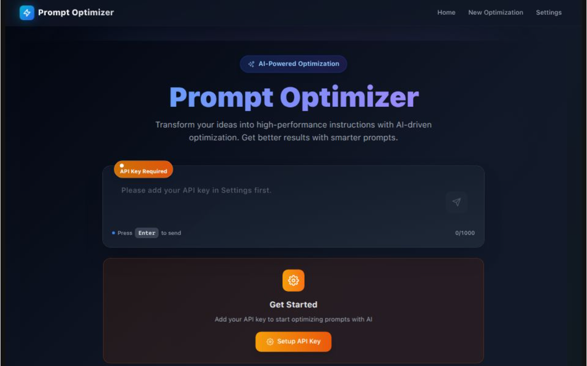

# AI Prompt Optimizer

A **Next.js** application that uses the **Gemini API** to optimize prompts for Large Language Models (LLMs). Designed with a **clean, modern, and futuristic UI** to enhance your prompt engineering workflow.



## 🚀 Features

- **AI-Powered Optimization:** Transform your prompts using Google's Gemini AI
- **Modern Glass-Morphism UI:** Beautiful, contemporary interface with smooth animations
- **Session Management:** Save and manage multiple optimization sessions
- **Real-time Chat Interface:** Interactive conversation-style optimization
- **One-Click Copy:** Instantly copy optimized prompts to clipboard
- **Responsive Design:** Works seamlessly on desktop and mobile devices
- **Dark Mode Support:** Automatic theme switching based on system preferences
- **Secure API Handling:** Client-side encryption for API key storage

## 🛠 Getting Started

### Prerequisites

- Node.js 18+ 
- A Gemini API key from [Google AI Studio](https://aistudio.google.com/app/apikey)

### 1. Clone the Repository

```bash
git clone https://github.com/Daniyal0100101/prompt-optimizer.git
cd prompt-optimizer
```

### 2. Install Dependencies

```bash
npm install
```

### 3. Environment Setup

Copy the example environment file and add your Gemini API key:

```bash
cp .env.example .env.local
```

Edit `.env.local` and add your API key:

```env
GEMINI_API_KEY=your_gemini_api_key_here
```

### 4. Run the Development Server

```bash
npm run dev
```

Visit [http://localhost:3000](http://localhost:3000) to view the app.

### 5. Build for Production

```bash
npm run build
npm start
```

## 🎯 Usage

1. **Setup:** Add your Gemini API key in the Settings page
2. **Optimize:** Enter your prompt on the main page and click "Optimize"
3. **Refine:** Continue the conversation to further improve your prompt
4. **Copy:** Use the copy button to get your optimized prompt
5. **Manage:** View and continue previous sessions from the main page

## 🏗️ Tech Stack

- **Framework:** Next.js 15 with App Router
- **UI:** Tailwind CSS with custom components
- **AI:** Google Gemini API
- **Icons:** Lucide React
- **Notifications:** React Hot Toast
- **Encryption:** Crypto-JS for secure API key storage
- **TypeScript:** Full type safety

## 📁 Project Structure

```
├── app/
│   ├── api/gemini/          # Gemini API route handler
│   ├── components/          # React components
│   │   ├── ui/             # Reusable UI components
│   │   └── PromptOptimizer.tsx
│   ├── optimize/           # Optimization pages
│   ├── settings/           # Settings page
│   └── utils/              # Utility functions
├── public/                 # Static assets
└── ...config files
```

## 🔒 Security

- API keys are encrypted using AES encryption before storage
- All sensitive data remains client-side
- No API keys are transmitted to external services
- Environment variables are properly configured

## 🚀 Deployment

### Vercel (Recommended)

1. Push your code to GitHub
2. Connect your repository to Vercel
3. Add your `GEMINI_API_KEY` environment variable
4. Deploy automatically

### Other Platforms

The app can be deployed to any platform that supports Next.js:
- Netlify
- Railway
- DigitalOcean App Platform
- AWS Amplify

## 🤝 Contributing

1. Fork the repository
2. Create a feature branch (`git checkout -b feature/amazing-feature`)
3. Commit your changes (`git commit -m 'Add amazing feature'`)
4. Push to the branch (`git push origin feature/amazing-feature`)
5. Open a Pull Request

## 📜 License

This project is licensed under the **Apache License 2.0** – see the [LICENSE](LICENSE) file for details.

## 🙏 Acknowledgments

- Google Gemini AI for powerful prompt optimization
- Next.js team for the excellent framework
- Tailwind CSS for the utility-first styling approach
