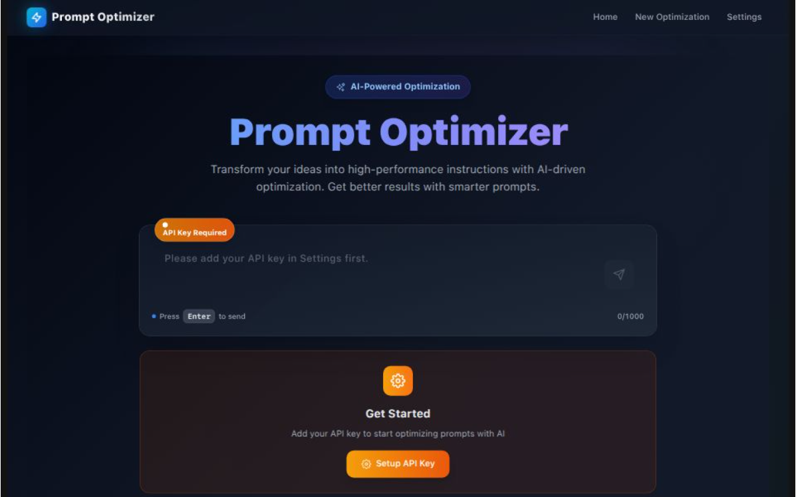

# AI Prompt Optimizer

A **Next.js** application that uses the **Gemini API** to optimize prompts for large language models. It ships with a clean, modern UI for iterative prompt improvement.



## Features

- Prompt optimization for supported Gemini models
- Local browser storage for your Gemini API key
- Side-by-side prompt refinement workflow
- Session history and quick prompt starters
- One-click copy for optimized output

## Getting Started

### 1. Install dependencies

```bash
npm install
```

### 2. Configure local environment

Create a `.env.local` file with a browser-side storage secret:

```env
NEXT_PUBLIC_SECRET_KEY=replace-with-a-long-random-string
```

This app encrypts the saved Gemini API key in the browser before writing it to `localStorage`. If `NEXT_PUBLIC_SECRET_KEY` is missing, API key storage is disabled.

### 3. Run the development server

```bash
npm run dev
```

Visit [http://localhost:3000](http://localhost:3000).

## Security notes

- Your Gemini API key is stored in the browser for this app only after client-side encryption.
- The key is sent when you submit a request through the app so the server route can call Gemini on your behalf.
- The app should not claim the key is never sent to the server; it is not persisted by design, but it does transit through the app's API route during request handling.
- Rotate any previously saved keys if you used an older build that relied on insecure fallback decryption behavior.

## Linting

This project uses the ESLint CLI directly:

```bash
npm run lint
```

## Deployment

The app is deployed on **Vercel** at [https://prompt-optimizer-tool-beta.vercel.app/](https://prompt-optimizer-tool-beta.vercel.app/). Source code: [https://github.com/Daniyal0100101/prompt-optimizer](https://github.com/Daniyal0100101/prompt-optimizer).

## License

This project is licensed under the **Apache License 2.0**. See [LICENSE](LICENSE).
